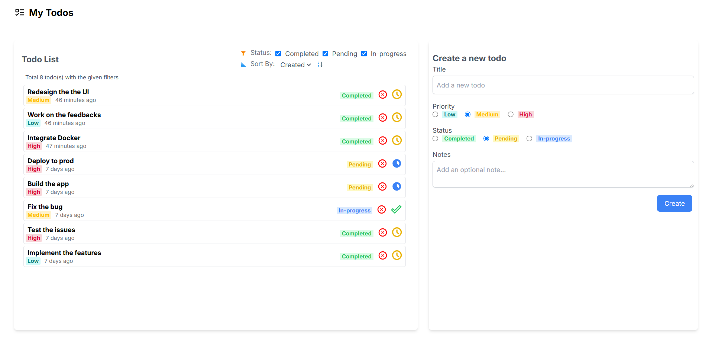
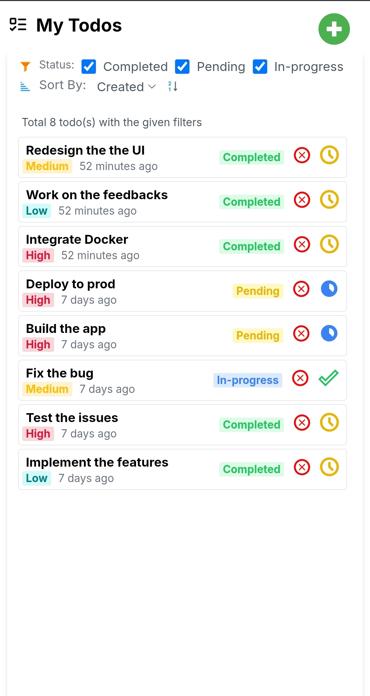

# frontend-challenge

## Tech to use
- nx
- Tailwind CSS
- React
- RecoilJS
- Typescript

## Build a TODO app


## Requirement
- This should all be client side. Do not worry about server side
- Pay attention to code and folder structures
- We are open to any suggestion and want to test your thinking and problem solving skills
- The aesthetics and animation matter. Use your imagination
- Make it a complete application so that it is usable
- All features of the tech stack should be used
- Make it responsive
- Fork this repository and submit your implementation

## Implementation

Below are the previews of the application:
<p style="display: flex; flex-direction: row; justify-content: space-between; align-items: center;">
  
  
</p>

## Live Link
[My Todos App](https://my-todos-cyan.vercel.app/)

## Requirements
- Node.js v18
- Nx version 20

## Installation Steps
1. Install Node.js v18 from [Node.js official website](https://nodejs.org/).
2. Install Nx globally using the following command:
   ```bash
   npm install -g nx
   ```
3. Install project dependencies:
   ```bash
   npm install
   ```
4. Run the project:
   ```bash
   npx nx serve my-todos
   ```
